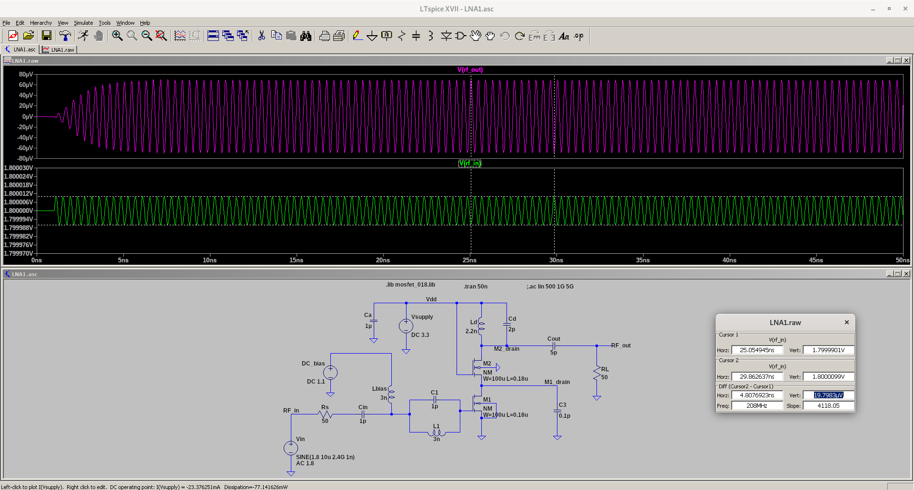
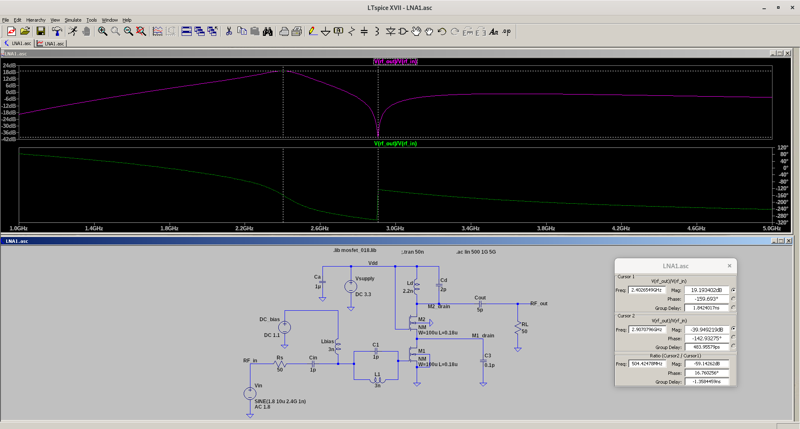

# LNA
 A 2.4 GHz Low Noise Amplifier circuit from the book "Design of CMOS RF Integrated Circuits and Systems" 
 
 
 *Transient Analysis*
 
 
 
 
 *AC Analysis*
 
 
 
 
 Note: The sharp AC magnitude dip at 2.91 GHz is due to resonance frequency of parallel LC tank consisting of L1 and C1
 
 TODO :
 
 1) Further increases the LNA gain
 2) Noise figure and non-linearity performance check
 3) Investigate the purpose of C3
 4) Try to further [reduce the existing inductance values](https://i.imgur.com/4mqh1AZ.png)
 
 Credit: edaboard and eevblog forums provide help in simulation
